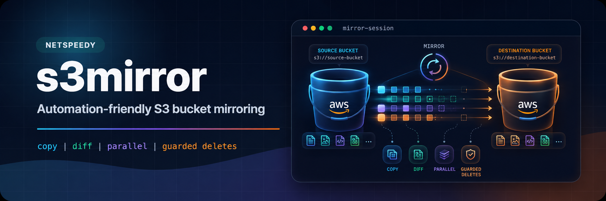

<p align="center">
  
</p>

<p align="center">
  Mirror buckets and objects between S3-compatible endpoints - one script, one config, clear logs.
</p>

<p align="center">
  <a href="https://github.com/netspeedy/s3mirror/tags"></a>
  <a href="LICENSE"></a>
  <a href="https://github.com/netspeedy/homebrew-s3mirror"></a>
  <a href="https://github.com/netspeedy/s3mirror"></a>
  <a href="https://www.python.org/"></a>
  <a href="https://buymeacoffee.com/soakes"></a>
</p>

---

## Install

```bash
brew tap netspeedy/s3mirror
brew install s3mirror
```

> On recent Homebrew, new third-party taps require explicit trust. If installation is refused, run `brew trust netspeedy/s3mirror` once, then `brew install s3mirror`.

Install the latest source from `main`:

```bash
brew install --HEAD s3mirror
```

Run a copy-only validation pass:

```bash
s3mirror --config config.yaml --no-delete --debug
```

## Available formulae

| Formula | Description |
|---|---|
| [`s3mirror`](Formula/s3mirror.rb) | S3-compatible bucket and object mirroring CLI |

## About this tap

This repository only packages the formula at [`Formula/s3mirror.rb`](Formula/s3mirror.rb). It is updated automatically on each stable [s3mirror release](https://github.com/netspeedy/s3mirror/releases). For source code, issues, and documentation, see the [main repository](https://github.com/netspeedy/s3mirror).

The formula uses Homebrew `python@3.14` and installs the latest available S3/Python runtime packages into an isolated virtual environment at install time. The package names are explicit because Homebrew installs Python formula dependencies with `--no-deps`, but their versions are not pinned.

## License

Copyright (c) 2026 [Simon Oakes](https://github.com/soakes). Released under the [MIT License](LICENSE).

This tap only packages the [s3mirror](https://github.com/netspeedy/s3mirror) formula, an unofficial community tool that is not affiliated with, endorsed by, or sponsored by AWS, Amazon S3, or any S3-compatible storage provider.
